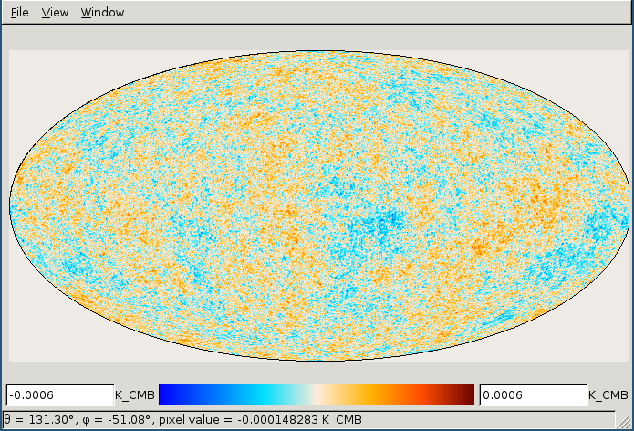

# HpView

A Healpix map viewer, written using [Free
Pascal](http://www.freepascal.org/) and
[Lazarus](http://www.lazarus-ide.org/).

## System requirements

Only [cfitsio](http://heasarc.gsfc.nasa.gov/fitsio/fitsio.html) is
required. The program implements its own Healpix projection routines.

Compile the program using Lazarus:

    lazbuild hpview.lpr

(under Windows, you have to download a precompiled binary from
http://heasarc.gsfc.nasa.gov/fitsio/fitsio.html and put `cfitsio.lib`
in the source directory.)

If you are using Linux, you can choose whether to use the Gtk2 or
Qt5 widget set using the `--ws=` flag:

    # Use Gtk2 (default)
    lazbuild --ws=gtk2 hpview.lpr
    # Use Qt5
    lazbuild --ws=qt5 hpview.lpr

These options should not be used under Windows or Mac OS X.

## Troubleshooting

If `lazbuild` produces the following error:

    Error: (lazarus) invalid Lazarus directory "": directory lcl not found

it means that your Lazarus configuration files are wrong or outdated. Check
whether you have a `/usr/lib/lazarus` or `/usr/share/lazarus` directory, and
whatever you find, run the following command:

    lazbuild --lazarusdir=DIR hpview.lpr

where `DIR` is the directory you have found in your system. This will rebuild
HpView and will re-create the configuration files used by `lazbuild`, so that
you will not have to use the option `--lazarusdir` again.

## Supported platforms

The program has been compiled and used on the following platforms:

- Linux Mint 17.2 64-bit (using Gtk+)
- Linux Manjaro 21.2 (using both Gtk+2 and Qt5)
- Windows 7 64-bit
- Windows 10 64-bit

## Screenshots

## License

This code is released under a GPL2 license. See the file [LICENSE.md](./LICENSE.md)
for further information.
